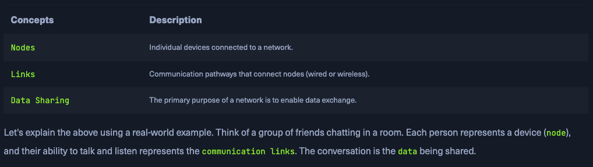

## Introduction to Networks

- LANs - Local Area Networks
- WANs - Wide Area Networks

Types of Networks vary in size and scope.

---

---

### How LANs and WANs work together?

When accessing the internet, a home LAN connects to an Internet Service Provider’s (ISP)

---

---

## Network Concept

Networking is foundational to modern technology, underlying nearly all systems through the TCP/IP stack. This section introduces core networking concepts, focusing on models and protocols that guide data exchange.

### **OSI Model Overview (7 Layers):**

1. **Physical Layer (L1):**
    
    Deals with raw bit transmission via physical hardware (e.g., cables, hubs).
    
2. **Data Link Layer (L2):**
    
    Manages direct node-to-node data transfer using MAC addresses; devices like switches operate here.
    
3. **Network Layer (L3):**
    
    Routes data across networks using IP addresses; routers function at this level.
    
4. **Transport Layer (L4):**
    
    Ensures end-to-end communication. TCP offers reliable delivery; UDP provides faster but less reliable service.
    
5. **Session Layer (L5):**
    
    Manages, maintains, and terminates communication sessions between systems.
    
6. **Presentation Layer (L6):**
    
    Translates data formats, handles encryption/decryption and compression.
    
7. **Application Layer (L7):**
    
    Interfaces with end-user applications; uses protocols like HTTP, FTP, SMTP, and DNS.
    

These layers help standardize network functions, making systems interoperable and communication efficient.

---

### **TCP/IP Model Summary**

The **TCP/IP model** is a simplified, practical version of the OSI model, designed specifically for real-world internet and network communication. It has **four layers**:

1. **Link Layer**
    
    Handles physical connections and data framing. Covers Ethernet, Wi-Fi, and other hardware-level protocols.
    
    *(Equivalent to OSI Layers 1–2: Physical + Data Link)*
    
2. **Internet Layer**
    
    Manages logical addressing (e.g., IP addresses) and packet routing across networks using protocols like IP and ICMP.
    
    *(Equivalent to OSI Layer 3: Network)*
    
3. **Transport Layer**
    
    Ensures end-to-end communication using TCP (reliable) or UDP (faster but unreliable). Handles packet sequencing and error checking.
    
    *(Equivalent to OSI Layer 4: Transport)*
    
4. **Application Layer**
    
    Supports services like web browsing (HTTP), file transfers (FTP), and email (SMTP). Provides interfaces for apps to communicate over the network.
    
    *(Covers OSI Layers 5–7: Session, Presentation, Application)*
    
    
    

---

### Common Network Protocols

---

### Transmission in Networking

**Transmission** refers to the process of sending data between devices over a medium. It involves three key aspects:

1. **Transmission Types**
    - **Analog**: Continuous signals (e.g., radio broadcasts).
    - **Digital**: Discrete signals (bits), used in modern networks and digital communication.
2. **Transmission Modes**
    - **Simplex**: One-way only (e.g., keyboard to computer).
    - **Half-Duplex**: Two-way, but one at a time (e.g., walkie-talkies).
    - **Full-Duplex**: Two-way, simultaneous (e.g., phone calls).
3. **Transmission Media**
    - **Wired**: Includes twisted pair cables (Ethernet), coaxial cables (TV), and fiber optics (high-speed internet).
    - **Wireless**: Includes radio waves (Wi-Fi), microwaves (satellites), and infrared (short-range devices).

Each medium and mode is chosen based on the network’s needs for speed, range, and reliability.

---

---

## Components of a Network

Modern computer networks rely on various hardware and software components that work together to enable data transmission, communication, and internet access.

### 🔹 **1. End Devices**

- **Examples**: Computers, smartphones, tablets, IoT devices
- **Function**: Send and receive data; user-facing part of the network
- **Interface**: Use wired (Ethernet) or wireless (Wi-Fi) connections

### 🔹 **2. Intermediary Devices**

- **Examples**: Routers, switches, modems, access points
- **Function**: Direct and manage traffic between devices or networks
- **Roles**: Routing, packet forwarding, congestion control, security

### 🔹 **3. Network Interface Cards (NICs)**

- **Function**: Connects a device to the network (wired or wireless)
- **Each NIC** has a unique MAC address; operates at Layer 2

### 🔹 **4. Routers**

- **Layer**: OSI Layer 3 (Network)
- **Function**: Forward data between networks using IP addresses and routing protocols (e.g., OSPF, BGP)

### 🔹 **5. Switches**

- **Layer**: OSI Layer 2 (Data Link)
- **Function**: Connect devices in a LAN; forwards data to the correct MAC address, reducing congestion

### 🔹 **6. Hubs**

- **Layer**: OSI Layer 1 (Physical)
- **Function**: Outdated; broadcasts data to all ports (inefficient)

### 🔹 **7. Network Media & Software Components**

- **Media**: Cables (Ethernet, fiber), wireless (Wi-Fi, Bluetooth)
- **Software**: Protocols (TCP/IP, HTTP, FTP), management tools, firewalls

### 🔹 **8. Cabling and Connectors**

- **Examples**: Ethernet cables, RJ-45 plugs
- **Function**: Provide physical paths for data transmission

### 🔹 **9. Network Protocols**

- **Function**: Set rules for communication
- **Examples**:
    - **TCP/IP** – Internet backbone
    - **HTTP/HTTPS** – Web browsing
    - **FTP** – File transfer
    - **SMTP** – Email

### 🔹 **10. Network Management Software**

- **Function**: Monitor and configure networks, detect faults, enforce security
- **Used by**: IT admins to manage enterprise networks

### 🔹 **11. Software Firewalls**

- **Function**: Protect individual devices by filtering traffic
- **Role**: Guard against unauthorized access, complement network-level security

### 🔹 **12. Servers**

- **Types**: Web, file, mail, database servers
- **Function**: Provide services/resources to clients; handle authentication, data storage, and access control
- **Model**: Client-Server

---

### A functional network requires:

- **End devices** (user interaction),
- **Intermediary devices** (data direction/control),
- **Servers** (resource delivery), and
- **Media + protocols** (transmission & communication rules)
    
    Together, they enable the internet and modern digital communication.
    

---

---
